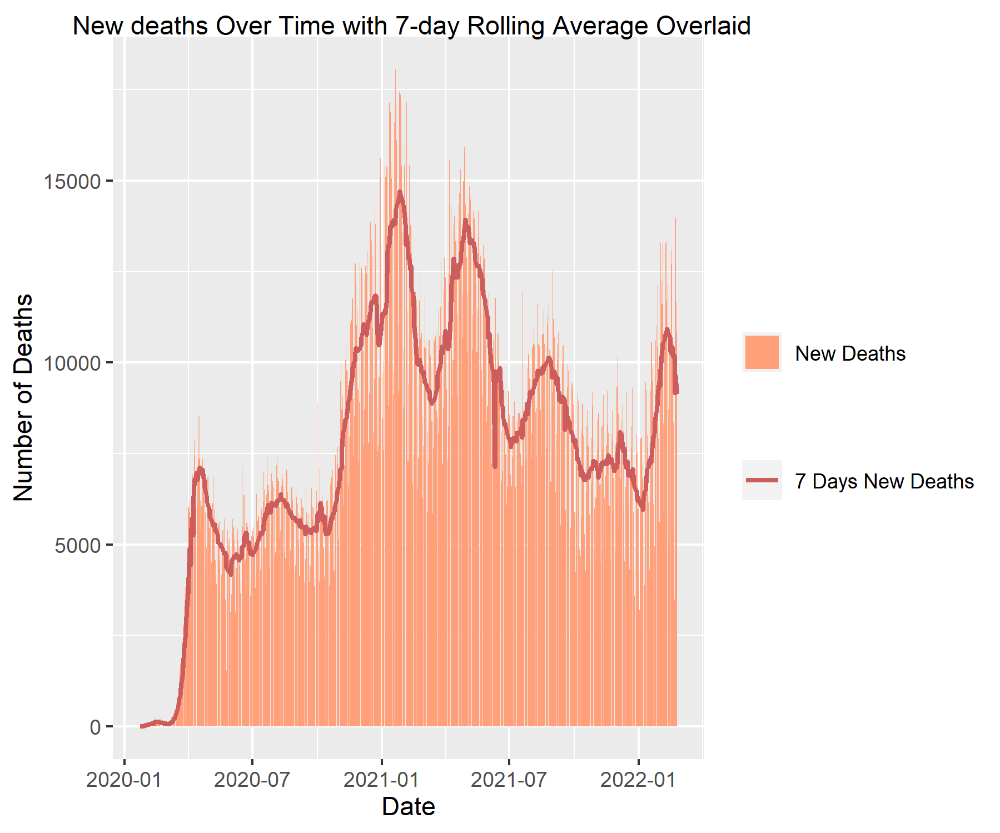

PubH7462_midterm_shen0464
================
You Shan Shen
2022/2/28

# I. Global COVID-19 from 2020 - Present: Initial (iterative) data read, description, exploration, clean, and tidy (30pts)

``` r
library(dplyr)
library(gt)
library(stringr)
library(lubridate)
library(purrr)
library(DataExplorer)

file_dir  <- "./data/"
data_files <- list.files(file_dir)
file_paths <- str_c(file_dir, data_files)
file_paths[1:7]

word_extractor <- function(string, sep, index) {
  word <- str_split_fixed(string, sep, str_length(string))[, index] %>% 
          str_replace_all("[[:punct:]]", "") 
  return(word) 
}

t1_file_list <- list.files(file_dir, pattern = "19")
t1_file_list <- t1_file_list[!str_detect(t1_file_list, c("data"))]

continent.df <- tibble(
           file_dir   = "./data/", 
           file_list  = t1_file_list, 
           continent = word_extractor(string = file_list, sep = "[_,.]", index = 2),
           file_paths = str_c(file_dir, file_list)
          ) %>%
          dplyr::select(continent, file_paths) 


Continent_data <- continent.df %>%
              mutate(
                data = map(.x = file_paths, ~read_csv(.x, show_col_types = FALSE))
              ) %>%
              dplyr::select(-file_paths)
```

``` r
data_explore_df  <- Continent_data %>% unnest(c(data))
DataExplorer::introduce(data_explore_df)
DataExplorer::plot_missing(data_explore_df )
```

``` r
DataExplorer::plot_bar(data_explore_df )
```

``` r
DataExplorer::plot_histogram(data_explore_df)
```

``` r
n_unique <- function(x) {
  length(unique(x))
}

Continent_data %>% as.tibble() %>%
  mutate(
    n_unique_country = map_dbl( .x = data, ~.x %>% pull(location)  %>% n_unique() ),
    
    population_sample_size =  map_dbl(.x = data, ~.x %>% pull(population) %>% n_unique()) ,
   
    all_unique  = ( n_unique_country == population_sample_size )
  )  
```

    ## # A tibble: 6 x 5
    ##   continent data          n_unique_country population_sample_size all_unique
    ##   <chr>     <list>                   <dbl>                  <dbl> <lgl>     
    ## 1 africa    <spec_tbl_df>               55                     55 TRUE      
    ## 2 asia      <spec_tbl_df>               49                     49 TRUE      
    ## 3 europe    <spec_tbl_df>               51                     51 TRUE      
    ## 4 north     <spec_tbl_df>               35                     35 TRUE      
    ## 5 oceania   <spec_tbl_df>               21                     21 TRUE      
    ## 6 south     <spec_tbl_df>               13                     13 TRUE

Check for uniqueness: To find the number of unique countries in each
data set, we use the number of unique populations to check and find they
match with each other.

In these six data files, we have 154098 observations, 13 variables, with
125762 missing values. These 13 variables contain 3 discrete and 10
continuous variables.

1.  In Africa, the frequencies are nearly 4 times that of South America
    and Oceania, and nearly 2 times that of North America. That’s to
    say, the number of the countries in Africa having COVID 19 is more
    than the other continents. Therefore, the area with lower population
    density, lower diabetes prevalence, and lower Gross domestic product
    (GDP) per capita has a higher frequency.

2.  For missing values, `new_deaths_smoothed`,
    `human_development_index`, `new_deaths`, `median_ age`, and
    `gdp_per_capita` have 10\~15% missing values, and
    `diabetes_prevalence`, `population_density`,
    `new_cases_smoothed`,and `new_cases` have under 10% missing values.

``` r
Sys.setlocale("LC_TIME", "C")
format(Sys.Date(), "%Y-%b-%d")
```

``` r
unnest_Continent_data <- Continent_data %>% 
  unnest(c(data)) %>%
  as_tibble() %>%
 janitor::clean_names() %>%
    rename(
       country  = location,
       "7 days new cases" = new_cases_smoothed,
       "7 days new deaths" = new_deaths_smoothed 
    ) %>%
    mutate(
     month   = month(date, label = TRUE, abbr = TRUE),
     dow     = wday(date, 
                   label = TRUE, 
                   abbr  = FALSE, 
                   week_start = getOption("lubridate.week.start", 1),
                   locale = Sys.getlocale("LC_TIME")),
     country = as.factor(country),
     continent = str_to_title(continent) %>% as.factor()
    ) %>%
  dplyr::select( -c("population_density", "diabetes_prevalence", "gdp_per_capita", "median_age", "human_development_index")) 

unnest_Continent_data %>% gt_preview()
```

<div id="jlwsdzadzm" style="overflow-x:auto;overflow-y:auto;width:auto;height:auto;">
<style>html {
  font-family: -apple-system, BlinkMacSystemFont, 'Segoe UI', Roboto, Oxygen, Ubuntu, Cantarell, 'Helvetica Neue', 'Fira Sans', 'Droid Sans', Arial, sans-serif;
}

#jlwsdzadzm .gt_table {
  display: table;
  border-collapse: collapse;
  margin-left: auto;
  margin-right: auto;
  color: #333333;
  font-size: 16px;
  font-weight: normal;
  font-style: normal;
  background-color: #FFFFFF;
  width: auto;
  border-top-style: solid;
  border-top-width: 2px;
  border-top-color: #A8A8A8;
  border-right-style: none;
  border-right-width: 2px;
  border-right-color: #D3D3D3;
  border-bottom-style: solid;
  border-bottom-width: 2px;
  border-bottom-color: #A8A8A8;
  border-left-style: none;
  border-left-width: 2px;
  border-left-color: #D3D3D3;
}

#jlwsdzadzm .gt_heading {
  background-color: #FFFFFF;
  text-align: center;
  border-bottom-color: #FFFFFF;
  border-left-style: none;
  border-left-width: 1px;
  border-left-color: #D3D3D3;
  border-right-style: none;
  border-right-width: 1px;
  border-right-color: #D3D3D3;
}

#jlwsdzadzm .gt_title {
  color: #333333;
  font-size: 125%;
  font-weight: initial;
  padding-top: 4px;
  padding-bottom: 4px;
  border-bottom-color: #FFFFFF;
  border-bottom-width: 0;
}

#jlwsdzadzm .gt_subtitle {
  color: #333333;
  font-size: 85%;
  font-weight: initial;
  padding-top: 0;
  padding-bottom: 6px;
  border-top-color: #FFFFFF;
  border-top-width: 0;
}

#jlwsdzadzm .gt_bottom_border {
  border-bottom-style: solid;
  border-bottom-width: 2px;
  border-bottom-color: #D3D3D3;
}

#jlwsdzadzm .gt_col_headings {
  border-top-style: solid;
  border-top-width: 2px;
  border-top-color: #D3D3D3;
  border-bottom-style: solid;
  border-bottom-width: 2px;
  border-bottom-color: #D3D3D3;
  border-left-style: none;
  border-left-width: 1px;
  border-left-color: #D3D3D3;
  border-right-style: none;
  border-right-width: 1px;
  border-right-color: #D3D3D3;
}

#jlwsdzadzm .gt_col_heading {
  color: #333333;
  background-color: #FFFFFF;
  font-size: 100%;
  font-weight: normal;
  text-transform: inherit;
  border-left-style: none;
  border-left-width: 1px;
  border-left-color: #D3D3D3;
  border-right-style: none;
  border-right-width: 1px;
  border-right-color: #D3D3D3;
  vertical-align: bottom;
  padding-top: 5px;
  padding-bottom: 6px;
  padding-left: 5px;
  padding-right: 5px;
  overflow-x: hidden;
}

#jlwsdzadzm .gt_column_spanner_outer {
  color: #333333;
  background-color: #FFFFFF;
  font-size: 100%;
  font-weight: normal;
  text-transform: inherit;
  padding-top: 0;
  padding-bottom: 0;
  padding-left: 4px;
  padding-right: 4px;
}

#jlwsdzadzm .gt_column_spanner_outer:first-child {
  padding-left: 0;
}

#jlwsdzadzm .gt_column_spanner_outer:last-child {
  padding-right: 0;
}

#jlwsdzadzm .gt_column_spanner {
  border-bottom-style: solid;
  border-bottom-width: 2px;
  border-bottom-color: #D3D3D3;
  vertical-align: bottom;
  padding-top: 5px;
  padding-bottom: 5px;
  overflow-x: hidden;
  display: inline-block;
  width: 100%;
}

#jlwsdzadzm .gt_group_heading {
  padding: 8px;
  color: #333333;
  background-color: #FFFFFF;
  font-size: 100%;
  font-weight: initial;
  text-transform: inherit;
  border-top-style: solid;
  border-top-width: 2px;
  border-top-color: #D3D3D3;
  border-bottom-style: solid;
  border-bottom-width: 2px;
  border-bottom-color: #D3D3D3;
  border-left-style: none;
  border-left-width: 1px;
  border-left-color: #D3D3D3;
  border-right-style: none;
  border-right-width: 1px;
  border-right-color: #D3D3D3;
  vertical-align: middle;
}

#jlwsdzadzm .gt_empty_group_heading {
  padding: 0.5px;
  color: #333333;
  background-color: #FFFFFF;
  font-size: 100%;
  font-weight: initial;
  border-top-style: solid;
  border-top-width: 2px;
  border-top-color: #D3D3D3;
  border-bottom-style: solid;
  border-bottom-width: 2px;
  border-bottom-color: #D3D3D3;
  vertical-align: middle;
}

#jlwsdzadzm .gt_from_md > :first-child {
  margin-top: 0;
}

#jlwsdzadzm .gt_from_md > :last-child {
  margin-bottom: 0;
}

#jlwsdzadzm .gt_row {
  padding-top: 8px;
  padding-bottom: 8px;
  padding-left: 5px;
  padding-right: 5px;
  margin: 10px;
  border-top-style: solid;
  border-top-width: 1px;
  border-top-color: #D3D3D3;
  border-left-style: none;
  border-left-width: 1px;
  border-left-color: #D3D3D3;
  border-right-style: none;
  border-right-width: 1px;
  border-right-color: #D3D3D3;
  vertical-align: middle;
  overflow-x: hidden;
}

#jlwsdzadzm .gt_stub {
  color: #333333;
  background-color: #FFFFFF;
  font-size: 100%;
  font-weight: initial;
  text-transform: inherit;
  border-right-style: solid;
  border-right-width: 2px;
  border-right-color: #D3D3D3;
  padding-left: 12px;
}

#jlwsdzadzm .gt_stub_row_group {
  color: #333333;
  background-color: #FFFFFF;
  font-size: 100%;
  font-weight: initial;
  text-transform: inherit;
  border-right-style: solid;
  border-right-width: 2px;
  border-right-color: #D3D3D3;
  padding-left: 12px;
  vertical-align: top;
}

#jlwsdzadzm .gt_row_group_first td {
  border-top-width: 2px;
}

#jlwsdzadzm .gt_summary_row {
  color: #333333;
  background-color: #FFFFFF;
  text-transform: inherit;
  padding-top: 8px;
  padding-bottom: 8px;
  padding-left: 5px;
  padding-right: 5px;
}

#jlwsdzadzm .gt_first_summary_row {
  border-top-style: solid;
  border-top-color: #D3D3D3;
}

#jlwsdzadzm .gt_first_summary_row.thick {
  border-top-width: 2px;
}

#jlwsdzadzm .gt_last_summary_row {
  padding-top: 8px;
  padding-bottom: 8px;
  padding-left: 5px;
  padding-right: 5px;
  border-bottom-style: solid;
  border-bottom-width: 2px;
  border-bottom-color: #D3D3D3;
}

#jlwsdzadzm .gt_grand_summary_row {
  color: #333333;
  background-color: #FFFFFF;
  text-transform: inherit;
  padding-top: 8px;
  padding-bottom: 8px;
  padding-left: 5px;
  padding-right: 5px;
}

#jlwsdzadzm .gt_first_grand_summary_row {
  padding-top: 8px;
  padding-bottom: 8px;
  padding-left: 5px;
  padding-right: 5px;
  border-top-style: double;
  border-top-width: 6px;
  border-top-color: #D3D3D3;
}

#jlwsdzadzm .gt_striped {
  background-color: rgba(128, 128, 128, 0.05);
}

#jlwsdzadzm .gt_table_body {
  border-top-style: solid;
  border-top-width: 2px;
  border-top-color: #D3D3D3;
  border-bottom-style: solid;
  border-bottom-width: 2px;
  border-bottom-color: #D3D3D3;
}

#jlwsdzadzm .gt_footnotes {
  color: #333333;
  background-color: #FFFFFF;
  border-bottom-style: none;
  border-bottom-width: 2px;
  border-bottom-color: #D3D3D3;
  border-left-style: none;
  border-left-width: 2px;
  border-left-color: #D3D3D3;
  border-right-style: none;
  border-right-width: 2px;
  border-right-color: #D3D3D3;
}

#jlwsdzadzm .gt_footnote {
  margin: 0px;
  font-size: 90%;
  padding: 4px;
}

#jlwsdzadzm .gt_sourcenotes {
  color: #333333;
  background-color: #FFFFFF;
  border-bottom-style: none;
  border-bottom-width: 2px;
  border-bottom-color: #D3D3D3;
  border-left-style: none;
  border-left-width: 2px;
  border-left-color: #D3D3D3;
  border-right-style: none;
  border-right-width: 2px;
  border-right-color: #D3D3D3;
}

#jlwsdzadzm .gt_sourcenote {
  font-size: 90%;
  padding: 4px;
}

#jlwsdzadzm .gt_left {
  text-align: left;
}

#jlwsdzadzm .gt_center {
  text-align: center;
}

#jlwsdzadzm .gt_right {
  text-align: right;
  font-variant-numeric: tabular-nums;
}

#jlwsdzadzm .gt_font_normal {
  font-weight: normal;
}

#jlwsdzadzm .gt_font_bold {
  font-weight: bold;
}

#jlwsdzadzm .gt_font_italic {
  font-style: italic;
}

#jlwsdzadzm .gt_super {
  font-size: 65%;
}

#jlwsdzadzm .gt_footnote_marks {
  font-style: italic;
  font-weight: normal;
  font-size: 75%;
  vertical-align: 0.4em;
}

#jlwsdzadzm .gt_asterisk {
  font-size: 100%;
  vertical-align: 0;
}

#jlwsdzadzm .gt_slash_mark {
  font-size: 0.7em;
  line-height: 0.7em;
  vertical-align: 0.15em;
}

#jlwsdzadzm .gt_fraction_numerator {
  font-size: 0.6em;
  line-height: 0.6em;
  vertical-align: 0.45em;
}

#jlwsdzadzm .gt_fraction_denominator {
  font-size: 0.6em;
  line-height: 0.6em;
  vertical-align: -0.05em;
}
</style>
<table class="gt_table">
  
  <thead class="gt_col_headings">
    <tr>
      <th class="gt_col_heading gt_columns_bottom_border gt_left" rowspan="1" colspan="1"></th>
      <th class="gt_col_heading gt_columns_bottom_border gt_left" rowspan="1" colspan="1">continent</th>
      <th class="gt_col_heading gt_columns_bottom_border gt_left" rowspan="1" colspan="1">country</th>
      <th class="gt_col_heading gt_columns_bottom_border gt_left" rowspan="1" colspan="1">date</th>
      <th class="gt_col_heading gt_columns_bottom_border gt_right" rowspan="1" colspan="1">population</th>
      <th class="gt_col_heading gt_columns_bottom_border gt_right" rowspan="1" colspan="1">new_cases</th>
      <th class="gt_col_heading gt_columns_bottom_border gt_right" rowspan="1" colspan="1">7 days new cases</th>
      <th class="gt_col_heading gt_columns_bottom_border gt_right" rowspan="1" colspan="1">new_deaths</th>
      <th class="gt_col_heading gt_columns_bottom_border gt_right" rowspan="1" colspan="1">7 days new deaths</th>
      <th class="gt_col_heading gt_columns_bottom_border gt_left" rowspan="1" colspan="1">month</th>
      <th class="gt_col_heading gt_columns_bottom_border gt_left" rowspan="1" colspan="1">dow</th>
    </tr>
  </thead>
  <tbody class="gt_table_body">
    <tr><td class="gt_row gt_right gt_stub" style="font-family: Courier;">1</td>
<td class="gt_row gt_left">Africa</td>
<td class="gt_row gt_left">Algeria</td>
<td class="gt_row gt_left">2020-02-25</td>
<td class="gt_row gt_right">44616626</td>
<td class="gt_row gt_right">1</td>
<td class="gt_row gt_right">NA</td>
<td class="gt_row gt_right">NA</td>
<td class="gt_row gt_right">NA</td>
<td class="gt_row gt_left">Feb</td>
<td class="gt_row gt_left">Tuesday</td></tr>
    <tr><td class="gt_row gt_right gt_stub" style="font-family: Courier;">2</td>
<td class="gt_row gt_left">Africa</td>
<td class="gt_row gt_left">Algeria</td>
<td class="gt_row gt_left">2020-02-26</td>
<td class="gt_row gt_right">44616626</td>
<td class="gt_row gt_right">0</td>
<td class="gt_row gt_right">NA</td>
<td class="gt_row gt_right">NA</td>
<td class="gt_row gt_right">NA</td>
<td class="gt_row gt_left">Feb</td>
<td class="gt_row gt_left">Wednesday</td></tr>
    <tr><td class="gt_row gt_right gt_stub" style="font-family: Courier;">3</td>
<td class="gt_row gt_left">Africa</td>
<td class="gt_row gt_left">Algeria</td>
<td class="gt_row gt_left">2020-02-27</td>
<td class="gt_row gt_right">44616626</td>
<td class="gt_row gt_right">0</td>
<td class="gt_row gt_right">NA</td>
<td class="gt_row gt_right">NA</td>
<td class="gt_row gt_right">NA</td>
<td class="gt_row gt_left">Feb</td>
<td class="gt_row gt_left">Thursday</td></tr>
    <tr><td class="gt_row gt_right gt_stub" style="font-family: Courier;">4</td>
<td class="gt_row gt_left">Africa</td>
<td class="gt_row gt_left">Algeria</td>
<td class="gt_row gt_left">2020-02-28</td>
<td class="gt_row gt_right">44616626</td>
<td class="gt_row gt_right">0</td>
<td class="gt_row gt_right">NA</td>
<td class="gt_row gt_right">NA</td>
<td class="gt_row gt_right">NA</td>
<td class="gt_row gt_left">Feb</td>
<td class="gt_row gt_left">Friday</td></tr>
    <tr><td class="gt_row gt_right gt_stub" style="font-family: Courier;">5</td>
<td class="gt_row gt_left">Africa</td>
<td class="gt_row gt_left">Algeria</td>
<td class="gt_row gt_left">2020-02-29</td>
<td class="gt_row gt_right">44616626</td>
<td class="gt_row gt_right">0</td>
<td class="gt_row gt_right">NA</td>
<td class="gt_row gt_right">NA</td>
<td class="gt_row gt_right">NA</td>
<td class="gt_row gt_left">Feb</td>
<td class="gt_row gt_left">Saturday</td></tr>
    <tr><td class="gt_row gt_right gt_stub" style="font-family: Courier; font-size: x-small; background-color: #E4E4E4;">6..154097</td>
<td class="gt_row gt_left" style="background-color: #E4E4E4;"></td>
<td class="gt_row gt_left" style="background-color: #E4E4E4;"></td>
<td class="gt_row gt_left" style="background-color: #E4E4E4;"></td>
<td class="gt_row gt_right" style="background-color: #E4E4E4;"></td>
<td class="gt_row gt_right" style="background-color: #E4E4E4;"></td>
<td class="gt_row gt_right" style="background-color: #E4E4E4;"></td>
<td class="gt_row gt_right" style="background-color: #E4E4E4;"></td>
<td class="gt_row gt_right" style="background-color: #E4E4E4;"></td>
<td class="gt_row gt_left" style="background-color: #E4E4E4;"></td>
<td class="gt_row gt_left" style="background-color: #E4E4E4;"></td></tr>
    <tr><td class="gt_row gt_right gt_stub" style="font-family: Courier;">154098</td>
<td class="gt_row gt_left">South</td>
<td class="gt_row gt_left">Venezuela</td>
<td class="gt_row gt_left">2022-02-24</td>
<td class="gt_row gt_right">28704947</td>
<td class="gt_row gt_right">387</td>
<td class="gt_row gt_right">568.429</td>
<td class="gt_row gt_right">1</td>
<td class="gt_row gt_right">7.571</td>
<td class="gt_row gt_left">Feb</td>
<td class="gt_row gt_left">Thursday</td></tr>
  </tbody>
  
  
</table>
</div>

``` r
covid_data <- unnest_Continent_data %>%
  filter(!is.na(new_cases), !is.na(new_deaths) ) %>%
  nest(-c(continent, country)) %>% 
  mutate(
    cumulative_cases = map(.x = data, ~.x %>% pull(new_cases) %>% cumsum()),
    cumulative_deaths = map(.x = data, ~.x %>% pull(new_deaths) %>% cumsum())
  ) %>% 
  unnest(c(cumulative_cases,cumulative_deaths,data))

covid_data %>% gt_preview()
```

<div id="idizjxqami" style="overflow-x:auto;overflow-y:auto;width:auto;height:auto;">
<style>html {
  font-family: -apple-system, BlinkMacSystemFont, 'Segoe UI', Roboto, Oxygen, Ubuntu, Cantarell, 'Helvetica Neue', 'Fira Sans', 'Droid Sans', Arial, sans-serif;
}

#idizjxqami .gt_table {
  display: table;
  border-collapse: collapse;
  margin-left: auto;
  margin-right: auto;
  color: #333333;
  font-size: 16px;
  font-weight: normal;
  font-style: normal;
  background-color: #FFFFFF;
  width: auto;
  border-top-style: solid;
  border-top-width: 2px;
  border-top-color: #A8A8A8;
  border-right-style: none;
  border-right-width: 2px;
  border-right-color: #D3D3D3;
  border-bottom-style: solid;
  border-bottom-width: 2px;
  border-bottom-color: #A8A8A8;
  border-left-style: none;
  border-left-width: 2px;
  border-left-color: #D3D3D3;
}

#idizjxqami .gt_heading {
  background-color: #FFFFFF;
  text-align: center;
  border-bottom-color: #FFFFFF;
  border-left-style: none;
  border-left-width: 1px;
  border-left-color: #D3D3D3;
  border-right-style: none;
  border-right-width: 1px;
  border-right-color: #D3D3D3;
}

#idizjxqami .gt_title {
  color: #333333;
  font-size: 125%;
  font-weight: initial;
  padding-top: 4px;
  padding-bottom: 4px;
  border-bottom-color: #FFFFFF;
  border-bottom-width: 0;
}

#idizjxqami .gt_subtitle {
  color: #333333;
  font-size: 85%;
  font-weight: initial;
  padding-top: 0;
  padding-bottom: 6px;
  border-top-color: #FFFFFF;
  border-top-width: 0;
}

#idizjxqami .gt_bottom_border {
  border-bottom-style: solid;
  border-bottom-width: 2px;
  border-bottom-color: #D3D3D3;
}

#idizjxqami .gt_col_headings {
  border-top-style: solid;
  border-top-width: 2px;
  border-top-color: #D3D3D3;
  border-bottom-style: solid;
  border-bottom-width: 2px;
  border-bottom-color: #D3D3D3;
  border-left-style: none;
  border-left-width: 1px;
  border-left-color: #D3D3D3;
  border-right-style: none;
  border-right-width: 1px;
  border-right-color: #D3D3D3;
}

#idizjxqami .gt_col_heading {
  color: #333333;
  background-color: #FFFFFF;
  font-size: 100%;
  font-weight: normal;
  text-transform: inherit;
  border-left-style: none;
  border-left-width: 1px;
  border-left-color: #D3D3D3;
  border-right-style: none;
  border-right-width: 1px;
  border-right-color: #D3D3D3;
  vertical-align: bottom;
  padding-top: 5px;
  padding-bottom: 6px;
  padding-left: 5px;
  padding-right: 5px;
  overflow-x: hidden;
}

#idizjxqami .gt_column_spanner_outer {
  color: #333333;
  background-color: #FFFFFF;
  font-size: 100%;
  font-weight: normal;
  text-transform: inherit;
  padding-top: 0;
  padding-bottom: 0;
  padding-left: 4px;
  padding-right: 4px;
}

#idizjxqami .gt_column_spanner_outer:first-child {
  padding-left: 0;
}

#idizjxqami .gt_column_spanner_outer:last-child {
  padding-right: 0;
}

#idizjxqami .gt_column_spanner {
  border-bottom-style: solid;
  border-bottom-width: 2px;
  border-bottom-color: #D3D3D3;
  vertical-align: bottom;
  padding-top: 5px;
  padding-bottom: 5px;
  overflow-x: hidden;
  display: inline-block;
  width: 100%;
}

#idizjxqami .gt_group_heading {
  padding: 8px;
  color: #333333;
  background-color: #FFFFFF;
  font-size: 100%;
  font-weight: initial;
  text-transform: inherit;
  border-top-style: solid;
  border-top-width: 2px;
  border-top-color: #D3D3D3;
  border-bottom-style: solid;
  border-bottom-width: 2px;
  border-bottom-color: #D3D3D3;
  border-left-style: none;
  border-left-width: 1px;
  border-left-color: #D3D3D3;
  border-right-style: none;
  border-right-width: 1px;
  border-right-color: #D3D3D3;
  vertical-align: middle;
}

#idizjxqami .gt_empty_group_heading {
  padding: 0.5px;
  color: #333333;
  background-color: #FFFFFF;
  font-size: 100%;
  font-weight: initial;
  border-top-style: solid;
  border-top-width: 2px;
  border-top-color: #D3D3D3;
  border-bottom-style: solid;
  border-bottom-width: 2px;
  border-bottom-color: #D3D3D3;
  vertical-align: middle;
}

#idizjxqami .gt_from_md > :first-child {
  margin-top: 0;
}

#idizjxqami .gt_from_md > :last-child {
  margin-bottom: 0;
}

#idizjxqami .gt_row {
  padding-top: 8px;
  padding-bottom: 8px;
  padding-left: 5px;
  padding-right: 5px;
  margin: 10px;
  border-top-style: solid;
  border-top-width: 1px;
  border-top-color: #D3D3D3;
  border-left-style: none;
  border-left-width: 1px;
  border-left-color: #D3D3D3;
  border-right-style: none;
  border-right-width: 1px;
  border-right-color: #D3D3D3;
  vertical-align: middle;
  overflow-x: hidden;
}

#idizjxqami .gt_stub {
  color: #333333;
  background-color: #FFFFFF;
  font-size: 100%;
  font-weight: initial;
  text-transform: inherit;
  border-right-style: solid;
  border-right-width: 2px;
  border-right-color: #D3D3D3;
  padding-left: 12px;
}

#idizjxqami .gt_stub_row_group {
  color: #333333;
  background-color: #FFFFFF;
  font-size: 100%;
  font-weight: initial;
  text-transform: inherit;
  border-right-style: solid;
  border-right-width: 2px;
  border-right-color: #D3D3D3;
  padding-left: 12px;
  vertical-align: top;
}

#idizjxqami .gt_row_group_first td {
  border-top-width: 2px;
}

#idizjxqami .gt_summary_row {
  color: #333333;
  background-color: #FFFFFF;
  text-transform: inherit;
  padding-top: 8px;
  padding-bottom: 8px;
  padding-left: 5px;
  padding-right: 5px;
}

#idizjxqami .gt_first_summary_row {
  border-top-style: solid;
  border-top-color: #D3D3D3;
}

#idizjxqami .gt_first_summary_row.thick {
  border-top-width: 2px;
}

#idizjxqami .gt_last_summary_row {
  padding-top: 8px;
  padding-bottom: 8px;
  padding-left: 5px;
  padding-right: 5px;
  border-bottom-style: solid;
  border-bottom-width: 2px;
  border-bottom-color: #D3D3D3;
}

#idizjxqami .gt_grand_summary_row {
  color: #333333;
  background-color: #FFFFFF;
  text-transform: inherit;
  padding-top: 8px;
  padding-bottom: 8px;
  padding-left: 5px;
  padding-right: 5px;
}

#idizjxqami .gt_first_grand_summary_row {
  padding-top: 8px;
  padding-bottom: 8px;
  padding-left: 5px;
  padding-right: 5px;
  border-top-style: double;
  border-top-width: 6px;
  border-top-color: #D3D3D3;
}

#idizjxqami .gt_striped {
  background-color: rgba(128, 128, 128, 0.05);
}

#idizjxqami .gt_table_body {
  border-top-style: solid;
  border-top-width: 2px;
  border-top-color: #D3D3D3;
  border-bottom-style: solid;
  border-bottom-width: 2px;
  border-bottom-color: #D3D3D3;
}

#idizjxqami .gt_footnotes {
  color: #333333;
  background-color: #FFFFFF;
  border-bottom-style: none;
  border-bottom-width: 2px;
  border-bottom-color: #D3D3D3;
  border-left-style: none;
  border-left-width: 2px;
  border-left-color: #D3D3D3;
  border-right-style: none;
  border-right-width: 2px;
  border-right-color: #D3D3D3;
}

#idizjxqami .gt_footnote {
  margin: 0px;
  font-size: 90%;
  padding: 4px;
}

#idizjxqami .gt_sourcenotes {
  color: #333333;
  background-color: #FFFFFF;
  border-bottom-style: none;
  border-bottom-width: 2px;
  border-bottom-color: #D3D3D3;
  border-left-style: none;
  border-left-width: 2px;
  border-left-color: #D3D3D3;
  border-right-style: none;
  border-right-width: 2px;
  border-right-color: #D3D3D3;
}

#idizjxqami .gt_sourcenote {
  font-size: 90%;
  padding: 4px;
}

#idizjxqami .gt_left {
  text-align: left;
}

#idizjxqami .gt_center {
  text-align: center;
}

#idizjxqami .gt_right {
  text-align: right;
  font-variant-numeric: tabular-nums;
}

#idizjxqami .gt_font_normal {
  font-weight: normal;
}

#idizjxqami .gt_font_bold {
  font-weight: bold;
}

#idizjxqami .gt_font_italic {
  font-style: italic;
}

#idizjxqami .gt_super {
  font-size: 65%;
}

#idizjxqami .gt_footnote_marks {
  font-style: italic;
  font-weight: normal;
  font-size: 75%;
  vertical-align: 0.4em;
}

#idizjxqami .gt_asterisk {
  font-size: 100%;
  vertical-align: 0;
}

#idizjxqami .gt_slash_mark {
  font-size: 0.7em;
  line-height: 0.7em;
  vertical-align: 0.15em;
}

#idizjxqami .gt_fraction_numerator {
  font-size: 0.6em;
  line-height: 0.6em;
  vertical-align: 0.45em;
}

#idizjxqami .gt_fraction_denominator {
  font-size: 0.6em;
  line-height: 0.6em;
  vertical-align: -0.05em;
}
</style>
<table class="gt_table">
  
  <thead class="gt_col_headings">
    <tr>
      <th class="gt_col_heading gt_columns_bottom_border gt_left" rowspan="1" colspan="1"></th>
      <th class="gt_col_heading gt_columns_bottom_border gt_left" rowspan="1" colspan="1">continent</th>
      <th class="gt_col_heading gt_columns_bottom_border gt_left" rowspan="1" colspan="1">country</th>
      <th class="gt_col_heading gt_columns_bottom_border gt_left" rowspan="1" colspan="1">date</th>
      <th class="gt_col_heading gt_columns_bottom_border gt_right" rowspan="1" colspan="1">population</th>
      <th class="gt_col_heading gt_columns_bottom_border gt_right" rowspan="1" colspan="1">new_cases</th>
      <th class="gt_col_heading gt_columns_bottom_border gt_right" rowspan="1" colspan="1">7 days new cases</th>
      <th class="gt_col_heading gt_columns_bottom_border gt_right" rowspan="1" colspan="1">new_deaths</th>
      <th class="gt_col_heading gt_columns_bottom_border gt_right" rowspan="1" colspan="1">7 days new deaths</th>
      <th class="gt_col_heading gt_columns_bottom_border gt_left" rowspan="1" colspan="1">month</th>
      <th class="gt_col_heading gt_columns_bottom_border gt_left" rowspan="1" colspan="1">dow</th>
      <th class="gt_col_heading gt_columns_bottom_border gt_right" rowspan="1" colspan="1">cumulative_cases</th>
      <th class="gt_col_heading gt_columns_bottom_border gt_right" rowspan="1" colspan="1">cumulative_deaths</th>
    </tr>
  </thead>
  <tbody class="gt_table_body">
    <tr><td class="gt_row gt_right gt_stub" style="font-family: Courier;">1</td>
<td class="gt_row gt_left">Africa</td>
<td class="gt_row gt_left">Algeria</td>
<td class="gt_row gt_left">2020-03-12</td>
<td class="gt_row gt_right">44616626</td>
<td class="gt_row gt_right">4</td>
<td class="gt_row gt_right">1.714</td>
<td class="gt_row gt_right">1</td>
<td class="gt_row gt_right">0.143</td>
<td class="gt_row gt_left">Mar</td>
<td class="gt_row gt_left">Thursday</td>
<td class="gt_row gt_right">4</td>
<td class="gt_row gt_right">1</td></tr>
    <tr><td class="gt_row gt_right gt_stub" style="font-family: Courier;">2</td>
<td class="gt_row gt_left">Africa</td>
<td class="gt_row gt_left">Algeria</td>
<td class="gt_row gt_left">2020-03-13</td>
<td class="gt_row gt_right">44616626</td>
<td class="gt_row gt_right">2</td>
<td class="gt_row gt_right">1.286</td>
<td class="gt_row gt_right">1</td>
<td class="gt_row gt_right">0.286</td>
<td class="gt_row gt_left">Mar</td>
<td class="gt_row gt_left">Friday</td>
<td class="gt_row gt_right">6</td>
<td class="gt_row gt_right">2</td></tr>
    <tr><td class="gt_row gt_right gt_stub" style="font-family: Courier;">3</td>
<td class="gt_row gt_left">Africa</td>
<td class="gt_row gt_left">Algeria</td>
<td class="gt_row gt_left">2020-03-14</td>
<td class="gt_row gt_right">44616626</td>
<td class="gt_row gt_right">11</td>
<td class="gt_row gt_right">2.857</td>
<td class="gt_row gt_right">1</td>
<td class="gt_row gt_right">0.429</td>
<td class="gt_row gt_left">Mar</td>
<td class="gt_row gt_left">Saturday</td>
<td class="gt_row gt_right">17</td>
<td class="gt_row gt_right">3</td></tr>
    <tr><td class="gt_row gt_right gt_stub" style="font-family: Courier;">4</td>
<td class="gt_row gt_left">Africa</td>
<td class="gt_row gt_left">Algeria</td>
<td class="gt_row gt_left">2020-03-15</td>
<td class="gt_row gt_right">44616626</td>
<td class="gt_row gt_right">11</td>
<td class="gt_row gt_right">4.143</td>
<td class="gt_row gt_right">1</td>
<td class="gt_row gt_right">0.571</td>
<td class="gt_row gt_left">Mar</td>
<td class="gt_row gt_left">Sunday</td>
<td class="gt_row gt_right">28</td>
<td class="gt_row gt_right">4</td></tr>
    <tr><td class="gt_row gt_right gt_stub" style="font-family: Courier;">5</td>
<td class="gt_row gt_left">Africa</td>
<td class="gt_row gt_left">Algeria</td>
<td class="gt_row gt_left">2020-03-16</td>
<td class="gt_row gt_right">44616626</td>
<td class="gt_row gt_right">6</td>
<td class="gt_row gt_right">4.857</td>
<td class="gt_row gt_right">0</td>
<td class="gt_row gt_right">0.571</td>
<td class="gt_row gt_left">Mar</td>
<td class="gt_row gt_left">Monday</td>
<td class="gt_row gt_right">34</td>
<td class="gt_row gt_right">4</td></tr>
    <tr><td class="gt_row gt_right gt_stub" style="font-family: Courier; font-size: x-small; background-color: #E4E4E4;">6..133803</td>
<td class="gt_row gt_left" style="background-color: #E4E4E4;"></td>
<td class="gt_row gt_left" style="background-color: #E4E4E4;"></td>
<td class="gt_row gt_left" style="background-color: #E4E4E4;"></td>
<td class="gt_row gt_right" style="background-color: #E4E4E4;"></td>
<td class="gt_row gt_right" style="background-color: #E4E4E4;"></td>
<td class="gt_row gt_right" style="background-color: #E4E4E4;"></td>
<td class="gt_row gt_right" style="background-color: #E4E4E4;"></td>
<td class="gt_row gt_right" style="background-color: #E4E4E4;"></td>
<td class="gt_row gt_left" style="background-color: #E4E4E4;"></td>
<td class="gt_row gt_left" style="background-color: #E4E4E4;"></td>
<td class="gt_row gt_right" style="background-color: #E4E4E4;"></td>
<td class="gt_row gt_right" style="background-color: #E4E4E4;"></td></tr>
    <tr><td class="gt_row gt_right gt_stub" style="font-family: Courier;">133804</td>
<td class="gt_row gt_left">South</td>
<td class="gt_row gt_left">Venezuela</td>
<td class="gt_row gt_left">2022-02-24</td>
<td class="gt_row gt_right">28704947</td>
<td class="gt_row gt_right">387</td>
<td class="gt_row gt_right">568.429</td>
<td class="gt_row gt_right">1</td>
<td class="gt_row gt_right">7.571</td>
<td class="gt_row gt_left">Feb</td>
<td class="gt_row gt_left">Thursday</td>
<td class="gt_row gt_right">512840</td>
<td class="gt_row gt_right">5625</td></tr>
  </tbody>
  
  
</table>
</div>

``` r
DataExplorer::introduce(covid_data)
DataExplorer::plot_missing(covid_data)
```

``` r
DataExplorer::plot_bar(covid_data )
```

``` r
DataExplorer::plot_histogram(covid_data)
```

After we tidy the data, the final data contains 133804 observations, 12
variables with 5 discrete and 7 continuous, and 114 missing values.

Variables description:

(a)Continuous `new_deaths`:New deaths attributed to COVID-19. Counts can
include probable deaths, where reported.  
`new_cases`:New confirmed cases of COVID-19. Counts can include probable
cases, where reported. `cumulative_deaths`: `cumulative_cases`:
`population`:Population. `7 days new deaths`:New deaths attributed to
COVID-19 (7-day smoothed). Counts can include probable deaths, where
reported. `7 days new cases`:New confirmed cases of COVID-19 (7-day
smoothed). Counts can include probable cases, where reported.

(b)Discrete `continent`: Continent of the geographical location.
`country`: Geographical location. `date`: Date of observation.
`month`:Month. `dow`: Day of the week.

Handle missing values and others: After exclude the missing values in
`new_cases` and `new_deaths` to calculate `cumulative cases` and
`cumulative deaths`, it left 114, 0.04%, missing values in
`7 days new cases` and `7 days new deaths`.

However, now, in Africa, the frequency becomes nearly 6 times that of
Oceania. On the other hand, other continents still maintain the same
relative ratio with Africa. It seems that Oceania has a higher
proportion of missing values than other continents. Based on the
frequency of continent and month, we assume that COVID-19 might be more
contagious in winter.

# II. Global COVID-19 from 2020 - Present: Summary Tables (35pts)

## i. Please summarise the total number of cases and deaths by continent, and include each continents’ daily average and standard deviation of new cases and deaths, in a single gt(). Comment on the trends you observe. (25pts)

``` r
covid19_agg_df <- 
  read.csv("./data/covid19_aggregate_data.csv") %>%
  as.tibble() 
  
covid19_summary <- covid19_agg_df %>%
  filter(!(location_type %in% c("Economic Status"))) %>%
  mutate( date  = lubridate::ymd(date),
          year  = lubridate::year(date) %>% as.factor()) %>%
  group_by(location) %>%
  summarise( across(c(total_cases, total_deaths),
                     list(sum = sum, average = mean, sd = sd),
                    na.rm = TRUE, 
                    .names = "{.col}_{.fn}")) %>%
  mutate("Total Cases and Deaths" = total_cases_sum + total_deaths_sum) %>%
  rename(
    Location = location,
    "Total Cases" = total_cases_sum ,
    "Daily Average Cases" = total_cases_average,
    "New Cases SD" = total_cases_sd,
    "Total Deaths" = total_deaths_sum ,
    "Daily Average Deaths" = total_deaths_average,
    "New Deaths SD" = total_deaths_sd)


gt_covid19 <- covid19_summary %>% 
  filter(!(Location %in% c("European Union", "World"))) %>%
  ungroup() %>%
  arrange(desc(`Total Cases and Deaths`)) %>%
   gt() %>% 
   tab_header("COVID-19 Case & Death Aggregate Summary") %>%
   data_color(
     columns = c(`Total Cases`,`Total Deaths`),
     colors = scales::col_numeric(
       palette = c("White", blues9),
       domain  = NULL )
     ) %>%
   tab_spanner( label = "Cases",
                columns = c(`Total Cases`, `Daily Average Cases`, `New Cases SD`) ) %>%
   tab_spanner( label = "Deaths",
                columns = c(`Total Deaths`, `Daily Average Deaths`, `New Deaths SD`)) %>%
   fmt_number(
     columns = 2:8, decimals = 2, suffixing = TRUE
     )  %>%
  grand_summary_rows(
    columns = c(`Total Cases`,`Total Deaths`),
    fns = list( `Global Total` = ~sum(.)),
    formatter = fmt_number,
    missing_text = ' ') %>%
  tab_source_note(
     source_note = "Data from Jan. 2020 - Feb. 2022, extracted from Our World In Data’s Github")

webshot::install_phantomjs(version = "2.1.1",
                           baseURL = "https://github.com/wch/webshot/releases/download/v0.3.1/",
                           force = FALSE)
 
dir.create("./figures", showWarnings = FALSE)
gtsave(gt_covid19, "./figures/gt_covid19.png") 
```


Asia and Europe are the continents having the most cases but Asia has
lower the total deaths even lower than South and North America. It might
indicate that Europe, South, and North America have more critically ill
patients than Asia or Asia has sufficient medical care to lower the
total deaths.

The number of total cases in South America is less than in North America
but the condition of total deaths is equivalent. We might assume that
South America has more critically ill patients or insufficient medical
resources.

## ii. Extend the table above to also display the top 5 countries per continent by total cases; including all the same summary information, aesthetics, and ordering. (10pts)

``` r
Top5_country <- covid_data %>%
  dplyr::select( continent, country, date, new_cases ) %>%
  group_by( continent, country) %>%
  summarise(total_new_cases = sum(new_cases)) %>%
  group_by( continent) %>%
  arrange( desc(total_new_cases)) %>%
  slice(1:5) 

Top5_summary <-  covid_data %>%
  filter( country %in% Top5_country$country) %>% 
  group_by(continent, country) %>%
  summarise( "Total Cases" = sum(new_cases),
             "Daily Average Cases" = mean(new_cases),
             "New Cases SD" = sd(new_cases)) %>%
  rename(
    Continent = continent,
    Country = country) %>%
  arrange(desc(`Total Cases`)) 
  
Top5_summary_gt <- Top5_summary %>%
  gt() %>% 
  tab_header("COVID-19 Cases Top 5 Countries per Continent Summary") %>%
  data_color(
    columns = c(`Total Cases`),
    colors = scales::col_numeric(
      palette = c("White", blues9),
      domain  = NULL )
    ) %>%
  tab_spanner( label = "Cases",
               columns = c(`Total Cases`, `Daily Average Cases`, `New Cases SD`) ) %>%
  fmt_number(
    columns = 3:5,
    decimals = 2,
    suffixing = TRUE
    ) %>%
  summary_rows(
    groups = TRUE,
    columns = c(`Total Cases`),
    fns = list( `Top 5 Country Total` = ~sum(., na.rm = TRUE)),
    formatter = fmt_number,
    decimals = 2,
    use_seps = FALSE
  ) %>%
  tab_source_note(
    source_note = "Data from Jan. 2020 - Feb. 2022, extracted from Our World In Data’s Github"
  ) 

gtsave(Top5_summary_gt, "./figures/Top5_summary.png")  
```


Combining the top 5 colored tables and the cases by continents table, we
can tell that most COVID 19 cases around the world are heavily
distributed in the United States and India in North America and Asia
respectively. On the other hand, in Europe, although they are in the
second serious place, the cases are evenly distributed between the
European countries.

# III. Global COVID-19 from 2020 - Present: Temporal Trends (35pts)

## i. Globally, on which days of the week are most cases and deaths reported, respectively? (10pts)

``` r
dow_data <- covid_data %>%
   dplyr::select( date, new_cases, new_deaths, month, dow) %>%
   mutate(YM =  format(date, format = "%Y-%m") ,                        
          year = lubridate::year(ymd(date)) %>% as.factor()) %>%
  group_by(date, dow) %>%
  summarise(across(c(new_cases, new_deaths),
                     list(sum = sum),
                    na.rm = TRUE, 
                    .names = "{.col}_{.fn}")) %>%
  ungroup() %>%
  mutate(dow = as.factor(dow) %>% fct_reorder(new_cases_sum, .desc = TRUE)) 

DOW_cases_gg <- dow_data %>%
   ggplot(aes(x = date, y = new_cases_sum, colour = dow)) +
  geom_point(alpha    = 0.16,
             shape    = 16,
             size     = 2,
             position = position_jitter(width  = 0, 
                                        height = 0.5e+06)) +
  stat_smooth(method  = "loess", 
              formula = "y ~ x",
              se      = FALSE,
              span    = 0.5,
              alpha   = 0.44) +
    labs(
      x = "Date",
      y = "New Cases",
      title = "Cases for Days of the Week"
    ) +
    scale_colour_viridis_d("Days of the week") +
    scale_x_date( 
    date_breaks = "1 month", 
    date_minor_breaks = "1 week", 
    date_labels = "%b '%y" 
    ) +
    theme(axis.text.x = element_text(angle = 45,
                                     vjust = 1.24,
                                     hjust = 1.2,
                                     size  = 10),
          axis.text.y = element_text(size  = 10))

ggsave("./figures/DOW_cases.png", DOW_cases_gg)
```


Based on the legend of the plot, we notice that Wednesday has more new
cases than others. However, Wednesday, Friday, and Thursday are almost
overlap so there are no significant differences between the three.

``` r
Dow_deaths_gg <- dow_data %>%
  mutate(dow = as.factor(dow) %>% fct_reorder(new_deaths_sum, .desc = TRUE)) %>%
   ggplot(aes(x = date, y = new_deaths_sum, colour = dow)) +
  geom_point(alpha    = 0.16,
             shape    = 16,
             size     = 2,
             position = position_jitter(width  = 0, 
                                        height = 2500)) +
  stat_smooth(method  = "loess", 
              formula = "y ~ x",
              se      = FALSE,
              span    = 0.5,
              alpha   = 0.44) +
    labs(
      x = "Date",
      y = "New Deaths",
      title = "Deaths for Days of the Week"
    ) +
    scale_colour_viridis_d("Days of the week") +
    scale_x_date( 
    date_breaks = "1 month", 
    date_minor_breaks = "1 week", 
    date_labels = "%b '%y" 
    ) +
    theme(axis.text.x = element_text(angle = 45,
                                     vjust = 1.24,
                                     hjust = 1.2,
                                     size  = 10),
          axis.text.y = element_text(size  = 10))

ggsave("./figures/DOW_deaths.png", Dow_deaths_gg)
```


Based on the legend of the plot, we know that Wednesday has more new
deaths than others. Thursday seems to have more deaths than Tuesday so
far. However, Tuesday starts overlapping with Wednesday in recent days
and the slope becomes steep.

## ii. Using ggplot, please recreate the global “rolling-average” plots (see below) for new cases and deaths, using your own theme, colours (25pts)

``` r
rolling_average <- covid_data %>%
  dplyr::select( date, `7 days new cases`, `7 days new deaths`, new_cases, new_deaths) %>%
  group_by(date) %>%
  summarise(across(c(`7 days new cases`, `7 days new deaths`, new_cases, new_deaths),
                   list(sum = sum),
                   na.rm = TRUE,
                   .names = "{.col}_{.fn}")) %>%
  ungroup() 
  
rolling_average_cases_gg <- rolling_average %>%
  ggplot(aes( x = date) ) +
    geom_col(aes(y = new_cases_sum, fill = "New Cases"), size = 1) +
    geom_line(aes(y = `7 days new cases_sum`, color = "7 Days New Cases"), size = 1.5, group = 1) +
    labs(
      x = "Date",
      y = "Number of Cases",
      color = "Legend",
      title = " New cases Over Time with 7-day Rolling Average Overlaid") +
  scale_fill_manual(name = "", values = c("New Cases"= "#CCCCFF")) +
  scale_color_manual(name = "", values = c("7 Days New Cases" = "#6495ED")) 
  
  
rolling_average_gg <- rolling_average %>%
  ggplot(aes( x = date) ) +
  geom_col(aes(y = new_deaths_sum, fill = "New Deaths"), size = 1) +
  geom_line(aes(y = `7 days new deaths_sum`, color = "7 Days New Deaths"), size = 1.5, group = 1) +
  labs(
    x = "Date",
    y = "Number of Deaths",
    title = " New deaths Over Time with 7-day Rolling Average Overlaid") +
  scale_fill_manual(name = "", values = c("New Deaths"= "LightSalmon")) +
  scale_color_manual(name = "", values = c("7 Days New Deaths" = "IndianRed")) 
  
ggsave("./figures/rolling_average_cases.png", rolling_average_cases_gg)  
ggsave("./figures/rolling_average.png", rolling_average_gg)
```



